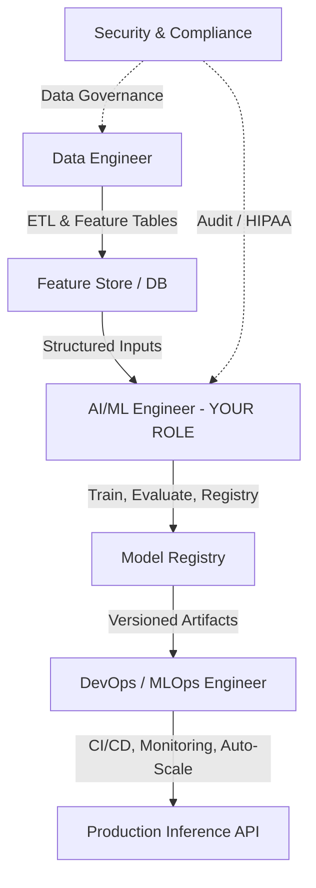
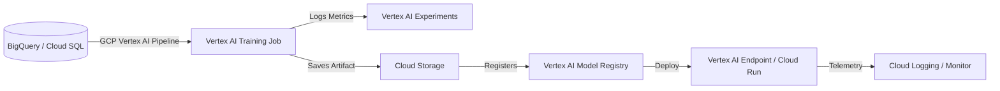
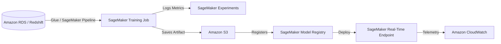

# Enterprise Transition Blueprint: Patient Health Risk MLOps Pipeline

This document details the transition of the **Automated Patient Health Risk Prediction Pipeline** from a personal/experimental stack (Supabase, Docker, Hugging Face, GitHub Actions) to production-grade, enterprise environments using **Google Cloud Platform (GCP)** and **Amazon Web Services (AWS)**.

---

## 1. Your Role as an AI/ML Engineer in an Enterprise Team

In a company or startup environment, you do not work in isolation. The project shifts from a single-person repository to a collaborative, multi-functional ecosystem. 



### Your Primary Responsibilities
1. **Model Architecture & Preprocessing**: Own the ML modeling scripts (like [train.py](file:///c:/Akash/AA/AI/Projects_Enterprise_Level_Resume/main/Healthcare_Domain/health-risk-mlops-pipeline/src/train.py) and [etl_pipeline.py](file:///c:/Akash/AA/AI/Projects_Enterprise_Level_Resume/main/Healthcare_Domain/health-risk-mlops-pipeline/src/etl_pipeline.py)), hyperparameter tuning, model validation split strategies, and export format optimization.
2. **Model Registry Management**: Package and version models with their metadata (training data split version, metrics, hyperparameters).
3. **Training & Inference Code Standard**: Ensure preprocessing steps are packaged together with the model (e.g., using `scikit-learn` Pipelines or custom transformers) to avoid **train-serve skew**.
4. **Monitoring & Drift Configuration**: Define baseline metrics for features and predictions so MLOps engineers can set up automated alerts for data drift or performance degradation.

### Cross-Functional Collaboration Interfaces
* **With Data Engineers**: Collaborate on how raw patient files are ingested into the database. You define the feature schema; they build robust, scheduled ETL processes to load it.
* **With DevOps/MLOps Engineers**: You hand over tested, containerized training/inference pipelines. They own the deployment infrastructure, Kubernetes clusters, auto-scaling rules, and IAM policies.
* **With Compliance & Security**: In healthcare (HIPAA / GDPR), you must ensure that **Protected Health Information (PHI)** is anonymized, models are explainable (e.g., SHAP/feature importance), and prediction APIs are secure.

---

## 2. Technology Stack Mapping

Below is a side-by-side comparison mapping your experimental stack to enterprise paid services in GCP and AWS.

| Pipeline Component | Experimental Stack (Current) | Enterprise GCP Stack | Enterprise AWS Stack |
| :--- | :--- | :--- | :--- |
| **Data Storage** | Supabase Cloud (PostgreSQL) | Google Cloud SQL (PostgreSQL) or BigQuery | Amazon RDS (PostgreSQL) or Amazon Redshift |
| **ETL / Orchestration** | Custom python script in GHA | Cloud Composer (Managed Airflow) or Dataflow | AWS Glue or Amazon Managed Workflows for Apache Airflow (MWAA) |
| **Model Registry** | Git (Committed files) | **Vertex AI Model Registry** | **Amazon SageMaker Model Registry** |
| **Experiment Tracking** | None / Console prints | Vertex AI Experiments / MLflow | SageMaker Experiments / MLflow |
| **Model Training** | Run during Docker Build | **Vertex AI Custom Training Jobs** | **Amazon SageMaker Training Jobs** |
| **Model Serving (Inference)** | Hugging Face Spaces (FastAPI) | **Vertex AI Endpoints** or Cloud Run | **SageMaker Real-Time Endpoints** or AWS ECS |
| **MLOps Pipeline (CT)** | GitHub Actions (Monthly cron) | **Vertex AI Pipelines** (Kubeflow) | **Amazon SageMaker Pipelines** |
| **Secrets Management** | GitHub Repository Secrets | Cloud Secret Manager | AWS Secrets Manager |
| **Monitoring & Alerting** | None | Vertex AI Model Monitoring + Cloud Logging | Amazon SageMaker Model Monitor + CloudWatch |

---

## 3. Step-by-Step Workflow: Google Cloud Platform (GCP)

Here is how you build, run, and scale this pipeline in GCP.



### Step 1: Secure Data Ingestion & Preprocessing
* **Implementation**: Raw patient records are ingested into **Google Cloud SQL (PostgreSQL)** or directly into **BigQuery** (data warehouse).
* **Your Task**: Write SQL queries or PySpark jobs that perform the ETL logic (imputation, clipping, encoding) inside BigQuery. BigQuery ML can also scale preprocessing natively.

### Step 2: Set Up Development Workspace
* **Implementation**: Spin up a **Vertex AI Workbench** instance (a managed JupyterLab environment) with access restricted via Google Cloud IAM.
* **Your Task**: Pull the codebase into your Workbench notebook. Test changes on a sample of patient data directly queried from BigQuery using GCP credentials.

### Step 3: Run Vertex AI Custom Training Jobs
* **Implementation**: Instead of training a model inside a Docker build (which is an anti-pattern in production), use **Vertex AI Training**.
* **Your Task**:
  1. Package your training logic into a Python package with `setup.py` or a Docker image pushed to **Artifact Registry**.
  2. Use the Vertex AI SDK to trigger a training job running on managed Compute Engine virtual machines.
  3. Save the trained model (`model.joblib` or `model.pkl`) alongside the fitted preprocessor (`preprocessor.joblib`) into a versioned **Google Cloud Storage (GCS)** bucket.

### Step 4: Track Experiments & Register the Model
* **Implementation**:
  * Use **Vertex AI Experiments** to log training parameters (e.g., Random Forest `max_depth`, `n_estimators`) and metrics (Precision, Recall, F1-Score).
  * Register the best model artifact in the **Vertex AI Model Registry**.
* **Your Task**: Track runs, compare metrics, and tag a model version as `production-ready`.

### Step 5: Production Deployment & Inference (In Serving Layer)
* **Option A: Vertex AI Endpoints (Recommended for ML Standard)**
  * Deploy the model from the Model Registry to a **Vertex AI Endpoint**. The service automatically wraps the model in a standardized API, handles auto-scaling, and manages container load-balancing.
* **Option B: Google Cloud Run (Custom API)**
  * If you need a fully customizable API (like your FastAPI code in [app.py](file:///c:/Akash/AA/AI/Projects_Enterprise_Level_Resume/main/Healthcare_Domain/health-risk-mlops-pipeline/src/app.py)), build a Docker image containing the code, load the model files from GCS, and deploy to **Cloud Run** (serverless containers).
* **Your Task**: Set up target schemas, configure test payloads, and verify response times under simulated load.

### Step 6: Orchestrate with Vertex AI Pipelines (Continuous Training)
* **Implementation**: Build a pipeline using Kubeflow Pipelines (KFP) SDK.
* **Your Task**: Write a pipeline script that links your ETL step, Training step, and Deployment step. Schedule this pipeline to run monthly or when performance drifts using **Cloud Scheduler**.

---

## 4. Step-by-Step Workflow: Amazon Web Services (AWS)

If the team decides to use AWS instead, here is the enterprise implementation:



### Step 1: Enterprise Data Layer & ETL
* **Implementation**: Raw patient records are stored in **Amazon RDS (PostgreSQL)** or **Amazon S3** as a data lake.
* **Your Task**: Set up an **AWS Glue** crawler and ETL job to process the raw patient data and save the clean, standardized dataset in another S3 location. Alternatively, use **SageMaker Feature Store** to store features for training and serving.

### Step 2: Develop on SageMaker Studio
* **Implementation**: Launch **Amazon SageMaker Studio** (managed IDE based on Jupyter).
* **Your Task**: Write and run scripts using the SageMaker SDK, connecting directly to S3 and Glue data catalogs.

### Step 3: Scale Training with SageMaker Jobs
* **Implementation**: SageMaker provisions compute containers on demand, runs the training script, and terminates the VMs automatically.
* **Your Task**: Write a containerized script (or use built-in AWS algorithms/scikit-learn containers) to train the model. S3 is used to pass input data and store the resulting model artifact `model.tar.gz`.

### Step 4: Register & Version Model
* **Implementation**: Save metadata and training logs in **SageMaker Experiments**.
* **Your Task**: Register the model package in the **SageMaker Model Registry** (with manual approval workflows built-in).

### Step 5: Real-time Production Serving
* **Implementation**: Deploy the model to a **SageMaker Real-Time Endpoint** or as an **AWS Lambda function** (if serverless, zero-maintenance is preferred).
* **Your Task**: Implement custom handlers for request validation, map output values, and secure the endpoint behind **Amazon API Gateway** with Cognito/OAuth security.

### Step 6: Continuous Automation with SageMaker Pipelines
* **Implementation**: Construct a workflow using **SageMaker Pipelines**.
* **Your Task**: Chain Glue jobs, training steps, evaluation steps, and registry approval steps. Trigger this using **Amazon EventBridge** when new patient batches arrive.

---

## 5. Enterprise-Grade Architecture Considerations

When shifting to GCP/AWS in a corporate team, keep the following operational pillars in mind:

### A. HIPAA & Data Privacy Compliance
> [!IMPORTANT]
> Healthcare data containing Patient Health Information (PHI) must be handled in compliance with HIPAA regulations.

* **Data Masking**: Ensure fields like name, social security numbers, or addresses are masked or excluded from datasets *before* they reach the model training environment.
* **Encryption**: Enable Customer-Managed Encryption Keys (CMEK) via **GCP KMS** or **AWS KMS** to encrypt data at rest (S3, GCS, RDS, BigQuery) and in transit.
* **Access Control**: Apply the Principle of Least Privilege using IAM roles. Your training pipelines and serving APIs should have dedicated service accounts with permissions limited *only* to the specific buckets and databases they need.

### B. Train-Serve Skew Mitigation
> [!WARNING]
> Your experimental stack has train-serve skew because preprocessing is run on the full database at build time, while the serving app uses hardcoded estimates.

* **Enterprise Solution**: 
  1. Save your scaler, encoder, and imputer inside a single `scikit-learn` Pipeline object:
     ```python
     from sklearn.pipeline import Pipeline
     from sklearn.compose import ColumnTransformer

     preprocessor = ColumnTransformer(transformers=[
         ('num', numeric_transformer, numeric_cols),
         ('cat', categorical_transformer, categorical_cols)
     ])

     full_pipeline = Pipeline(steps=[
         ('preprocessor', preprocessor),
         ('model', RandomForestClassifier(...))
     ])
     ```
  2. Save `full_pipeline` as a single `model.joblib` or `model.pkl`.
  3. In your GCP/AWS prediction service, load `full_pipeline`. Feed the raw API JSON inputs directly into `full_pipeline.predict()`. This guarantees that training and serving transformations are 100% identical.

### C. Monitoring & Drift Detection
> [!TIP]
> Models degrade over time as demographics, patient behaviors, or hospital logging systems change.

* **Data Drift**: Monitor if the distribution of incoming patient feature data (e.g., average BMI or age) shifts compared to the training baseline.
* **Concept Drift**: Monitor if the relationship between features and the target changes (e.g., patients with the same BMI are now classified differently due to clinical changes).
* **Tooling**:
  * **GCP**: Use **Vertex AI Model Monitoring** to compare incoming serving logs in BigQuery to baseline training datasets. Set up alerts to notify the team via Slack/PagerDuty.
  * **AWS**: Use **Amazon SageMaker Model Monitor** which captures real-time endpoint traffic, checks it against baseline constraints, and runs weekly reports.
