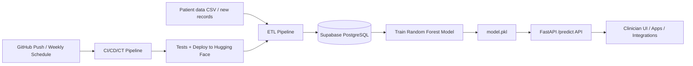

# Health Risk MLOps Pipeline — Problem Statement & Business Context

## Overview

This project is an **automated machine learning system** that estimates a patient's **health risk level** (Low / Medium / High) from everyday health inputs — age, BMI, smoking, alcohol, physical activity, sleep, chronic conditions, and stress.

It is built as a **production-style MLOps pipeline**, not just a notebook model. Data processing, training, deployment, and retraining are wired together like they would be in a real healthcare or health-tech organization.

---

## Problem Statement

Healthcare and insurance organizations face a recurring challenge:

> **How do you identify which patients are at higher risk before serious illness or costly interventions — at scale, continuously, and with fresh data?**

Doctors and care teams cannot manually review every patient record. Risk is driven by many factors (lifestyle, vitals, chronic history, stress). Data also keeps changing as new patients are added.

**This project addresses that by:**

1. Ingesting patient data into a cloud database
2. Cleaning and preparing it automatically (ETL)
3. Training a classification model on that data
4. Serving predictions through a live API
5. Retraining on a schedule as new data arrives (Continuous Training)

---

## What the System Does (End-to-End)

| Stage | What Happens | Business Meaning |
|-------|--------------|------------------|
| **Data ingestion** | Raw patient records land in Supabase (`raw_patient_records`) | Single source of truth for patient data |
| **ETL** | Missing values handled, outliers clipped, categories encoded, features scaled | Consistent, reliable inputs for modeling |
| **Training** | Random Forest learns patterns → saves `model.pkl` | Automated risk scoring engine |
| **API** | `POST /predict` accepts patient details → returns risk tier | Real-time decision support for apps and staff |
| **CI/CD/CT** | GitHub Actions runs tests, deploys to Hugging Face, retrains weekly | Model stays tested, deployed, and up to date |

**Example input:** A 48-year-old male, BMI 29.4, hypertension, moderate stress  
**Example output:** `"assigned_health_risk_tier": "Medium"` or `"High"`

---

## Where This Would Be Used (Real-World Scenarios)

### 1. Hospitals & Clinics (Population Health)

- **Use:** Screen large patient panels and flag high-risk individuals for follow-up
- **Who uses it:** Care coordinators, nurses, primary care teams
- **Value:** Earlier intervention, fewer emergency visits

### 2. Health Insurance & Payers

- **Use:** Risk stratification for wellness programs and preventive care
- **Who uses it:** Actuarial teams, care management, member outreach
- **Value:** Lower claims cost by focusing prevention on high-risk members

### 3. Telehealth & Digital Health Apps

- **Use:** After a user fills a health questionnaire, API returns risk level instantly
- **Who uses it:** Mobile app users, chatbot flows, remote monitoring platforms
- **Value:** Scalable triage without a doctor reviewing every form

### 4. Corporate Wellness Programs

- **Use:** Assess employee health risk from wellness survey data
- **Who uses it:** HR wellness teams, occupational health
- **Value:** Targeted programs (fitness, mental health, smoking cessation)

### 5. Public Health & Research (Pilot Scale)

- **Use:** Analyze community health trends from anonymized datasets
- **Who uses it:** Analysts, epidemiologists
- **Value:** Data-driven policy and resource allocation

The repo also includes a **Streamlit dashboard** (`src/dashboard.py`) and a **client script** (`main.py`) that call the live Hugging Face API — mimicking how a frontend or partner system would consume the model in production.

---

## Business Impact

### Clinical & Patient Outcomes

- **Proactive care:** High-risk patients identified before acute events
- **Personalization:** Lifestyle-based signals complement clinical history
- **Consistency:** Same scoring logic applied to every patient, reducing human bias in triage

### Operational Efficiency

- **Automation:** ETL + training + deployment run without manual handoffs
- **Speed:** API responses in seconds vs. manual chart review
- **Scale:** One model serves thousands of requests via cloud hosting (Hugging Face)

### Financial Impact

- **Cost avoidance:** Prevention is cheaper than ER visits, hospitalization, and chronic complications
- **Resource optimization:** Care teams focus on highest-risk patients first
- **Faster time-to-value:** CI/CD means model updates reach production quickly after code or data changes

### Strategic / Enterprise Value

- **MLOps maturity:** Demonstrates CI (tests), CD (auto-deploy), CT (scheduled retraining) — what employers expect in healthcare AI roles
- **Cloud-ready architecture:** Supabase + Docker + GitHub Actions maps cleanly to GCP/AWS enterprise stacks (Cloud Run, SageMaker, RDS, etc.)

---

## Why MLOps Matters Here (Not Just "a Model")

In healthcare, a model alone is not enough. You need:

| Capability | Why It Matters in Healthcare |
|------------|------------------------------|
| **Automated testing** | Broken API = wrong or no predictions for patients |
| **Versioned deployment** | Every release is traceable for audit/compliance |
| **Scheduled retraining** | Risk patterns change as new patient data arrives |
| **Secure secrets** | Database credentials must not live in code |
| **Containerization** | Same environment in dev, CI, and production |

The GitHub Actions workflow runs **pytest** on every push and **mirrors to Hugging Face** for deployment, with a **weekly cron** for retraining — that is the "continuous" part of the pipeline.

---

## Sample Data Context

The dataset (`data/healthcare_real_time_dataset.csv`, ~1000 rows) includes:

- **Demographics:** Age, Gender
- **Lifestyle:** BMI, smoking, alcohol, physical activity, sleep, stress
- **Clinical:** Chronic disease history
- **Target:** Health Risk Level (Low / Moderate / High)

This profile fits **preventive care and wellness risk scoring**, not acute diagnosis (e.g. "is this a heart attack right now?"). In a real product, this would sit alongside — not replace — clinical judgment and regulated diagnostic tools.

---

## One-Line Elevator Pitch

> **An enterprise MLOps pipeline that automatically ingests patient health data, trains a risk classification model, and serves real-time Low/Medium/High predictions through a cloud API — with automated testing, deployment, and weekly retraining.**

---

## Resume / Interview Talking Points

When describing the project, emphasize:

1. **Business problem:** Early identification of at-risk patients at scale
2. **Technical solution:** ETL → cloud DB → ML training → FastAPI → Docker → CI/CD/CT
3. **Impact:** Faster triage, lower cost, continuous model freshness
4. **Production mindset:** Tests, secrets, containers, scheduled retraining — not just accuracy metrics

---

## Architecture Stack

| Layer | Technology |
|-------|------------|
| **Data Layer** | Supabase Cloud PostgreSQL |
| **ETL & Training** | Python, pandas, scikit-learn |
| **Model Serving** | FastAPI + Uvicorn |
| **Containerization** | Docker (Python 3.10) |
| **Deployment** | Hugging Face Spaces |
| **Automation** | GitHub Actions (CI/CD/CT) |
